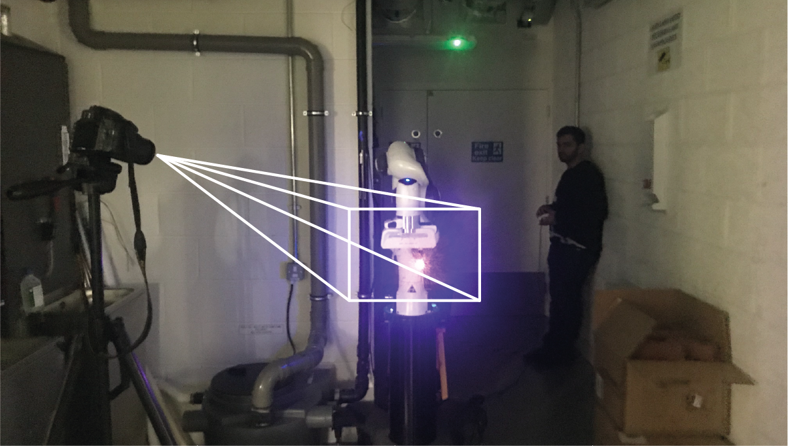

#### Image Capture
**********

To ensure the light painting will be visible, the surrounding lights should be turned off to increase contrast, while using long exposure photography to capture each frame. 

Set the camera ISO to 100 to reduce the graininess of images. To reduce light entering the camera and increasing contrast, set the aperture to f/22. Ensure the entire image is in focus by using ensuring the depth of field is at its maximum depending on your camera. This can be calculated [here](https://www.dofmaster.com/dofjs.html).

Mount the camera on a tripod with an external camera remote to avoid camera shake. Set the camera on “time” mode, so that one press of the shutter would open the aperture and another would close the aperture.
As the duration of each frame varies, this would provide a simple error-proof method. 

Before taking photos, focus the camera on the origin of the end-effector using autofocus and then put on manual focus for the rest of the images. 

With the code provided, Franka Emika would signal when to press the shutter by wiggling before and after each frame begins.

