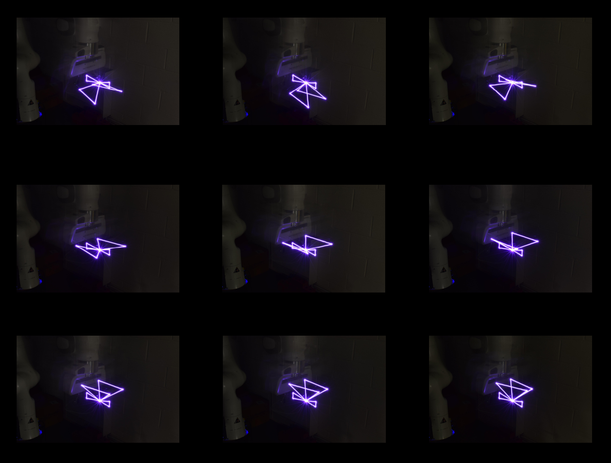

## Processing Photos

Once the images for each animation frame have been captured the animation can be created by using a video editing software such as iMovie. To create the video import every image and set it to show for a very short amount of time. Alternatively, a GIF creation application could be used however this will produce a poorer quality video.

