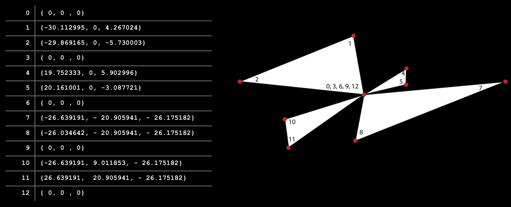
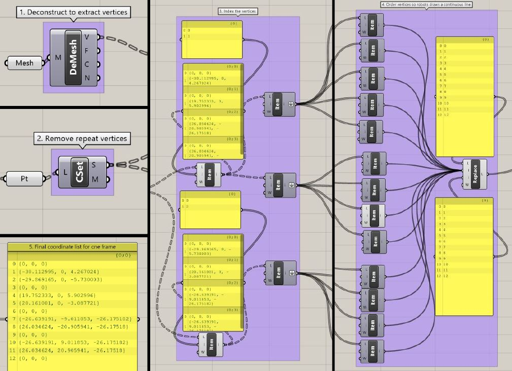

## Animation Creation
**********

The butterfly model was simplified to a low-poly model since it was expected that a large number of frames would be needed to form a smooth animation. I was also intended that the focus was on the animation itself and not on the model. As the project was limited in terms of time with the robot, a simplified outline presented the most opportunity to iterate and increase robotic complexity. Ie. A low fidelity model reduces the amount of time necessary for the robot to complete each frame. 

Using slow-motion footage of butterflies in flight, one model for each frame of the animation was created in [Rhinoceros 3D](https://www.rhino3d.com/).  The animation was simplified to 11 frames. The angles of the butterfly wings about the x-axis and the z-axis are approximately sinusoidal. A subtle body wiggle was also added, which is a small, random rotation of the two body triangles about the y-axis. Angles about axes are shown in [this video](https://imperialcollegelondon.box.com/s/qdrymjcbszoux44az3qeqkwr19efs0dn).

    *NOTE
    Grasshopper is a plugin included in Rhino 6, which has built-in functions called 'components' to allow for easy data manipulation. 

#### Butterfly Animation

To create your own butterfly animation, follow these steps below:

    1. Open Rhino 6.

    2. Draw an equilateral triangle on the XY plane, with one vertex on the origin.

    3. With the mirror command, mirror the triangle through the XZ plane to form the butterfly wings.

    4. Draw an isosceles triangle on the XZ plane with the vertex corresponding to the smallest angle to the origin.

    5. Using the mirror command, mirror the triangle through the XY plane to form the butterfly body.

    6. "CTRL +G" to group all four triangles.

    7. Copy the group to get 11 instances in total where 1 is for each frame.

    8. Isolate each group to it's separate layer by using the 'Change Layer Command'.

    9. Rotate the wings about the X and Z axes according to with the reference of a butterfly flight footage incrementally over 11 frames.

    10. Open the Grasshopper plugin.

    11. Open the stl_file_to_edges_and_coordinates.gh file in Grasshopper. 

    12. Right-click on the first block in each frame and click 'Set Multiple Meshes'.

    13. Select the group in the associated layer. Ie. Layer 1 group for frame 1.

    14. Wait for the algorithm to run.

    15. Right-click on the last block for each frame and select 'Copy Data Only'.

    16. Paste the data in your preferred text editor in the correct frame order.

    17. Replace all curly brackets with square brackets.

    18. Format the data so that it looks like the list in coordinate_list_about-origin.py
    
- The stl_file_to_edges_and_coordinates.gh file can be found [here](https://imperialcollegelondon.box.com/s/6u80r0g7vsitpzp55wts49q7c3fufacl)
- The coordinate_list_about-origin.py file can be found [here](https://imperialcollegelondon.box.com/s/achz2lw7so5wnkm1lnh4fctska04rhh0)

#### General Animation

These are the general steps which can be repeated to output the same result for each frame in Grasshopper of your animation of choice:

    1. Deconstruct a single image into vertices, faces, colours and normals using the 'deconstruct mesh' components. 

    2. The output will be a list of a list, where each vertex is in an XYZ coordinate.

    3. Remove any repeated centre vertices by putting the lists through the 'create set' component.

    4. Extract each sublist using the 'list item' component.

    5. Recorded the list for the robot to move from coordinate to coordinate without retracing the same path twice. 
    
    *NOTE This is important to avoid any brighter spots in the animation frames which would be seen as an anomaly.

    6. The list of coordinates will be in curly brackets, replace them with square brackets.

This general method allows for the flexibility of changing the butterfly animation frame by frame without the need to manually change each coordinate. This would also allow for more complexity to be added easily on the butterfly models (ie. higher poly models), at the cost of longer per-frame drawing time. The Grasshopper definition shown in the figure below is robust enough to deal with having curved lines and would output these as a higher number of interpolated points to form the curves. 

