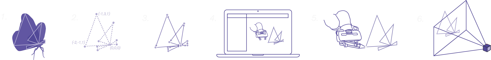

#### Method Overview
**********
This project was implemented and segmented into 6 main steps

###### 1. Animation Sequencing
The model sequence of the butterfly in flight was generated using Rhinoceros3D and the Grasshopper plugin, iteratvely altering a low-poly mesh to give the effect of a butterfly flapping its wings. 
###### 2. Coordinate Generation
The frame sequence was then treated as individual frames, with the coordinates of each one being extracted and processed to eliminate duplicae points. The coordinates were organised to prevent duplicate paths.
###### 3. Motion Planning
A motion plan was then generated for each frame using the coordinate list created in the previous step. Code to iterate over the list of frames and plan each motion was developed. This was simulated using RViz and Gazebo.
###### 4. Simulation
Once simulated successfully, the code was implemented using Franka Emika’s Panda robotic arm. 
###### 5. Implementation
An end-effector attachment containing a controllable LED was simultaneously developed and manufactured to facilitate light painting
###### 6. Image Capture
Once the code successfully ran repeatedly on the Panda robot, long-exposure photgraphs were captured of the motion. These photographs were then collated and displayed in sequence to create an animation of a butterfly in flight.