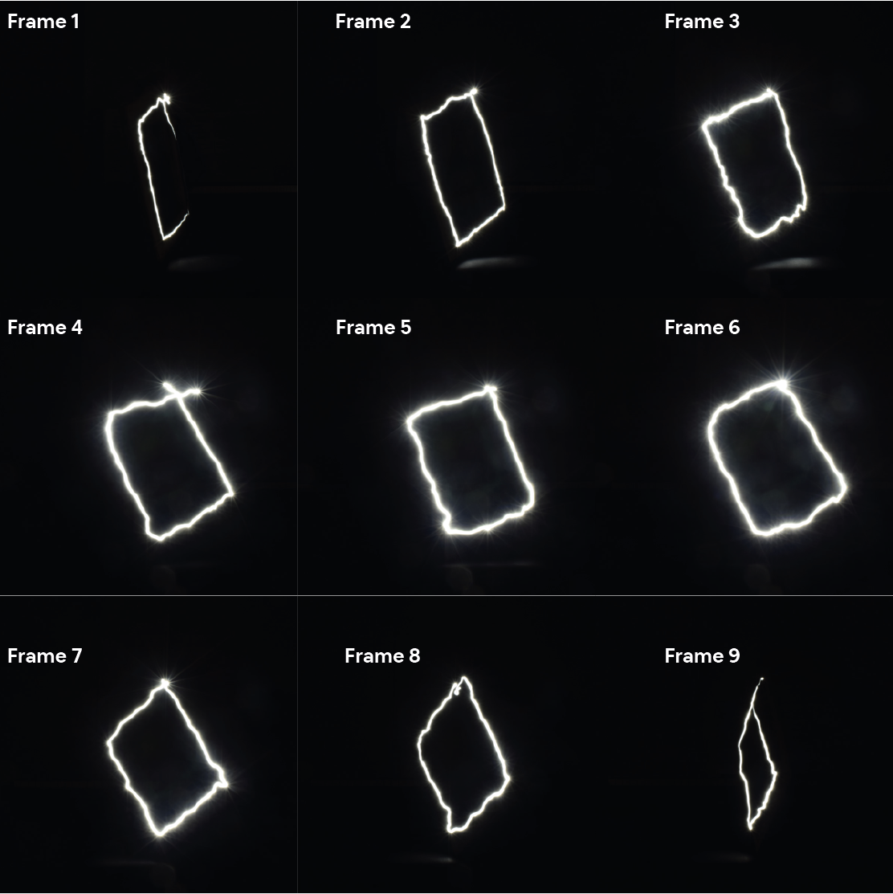

## Introduction
**********
Drawing inspiration from light painting images, this project entails programming the Franka Emika robotic arm to draw several still images of a butterfly with light to produce a stop motion animation.

## Lo-Fi Beta Testing
**********
To validate the concept, a beta test was first conducted without the robotic arm. In this experiment, a human, an iPhone torch, a template, a stand, a camera and a tripod were used.

The template was rotated at approximately 20 degree intervals through 180 degrees, pivoting on the stand. At each rotation, a long exposure image was taken on the camera and the human moved the light around the frame. Once this sequence was complete, the images were manually compiled in a video editing software to create the beta test animation.

### Steps

1. Mount camera on tripod & template about stand
2. Open camera shutter
3. Trace image with torch
4. Close camera shutter
5. Rotate template approximately 20&deg; about stand
6. Repeat steps 2 to 5
7. Import images
8. Compile images

