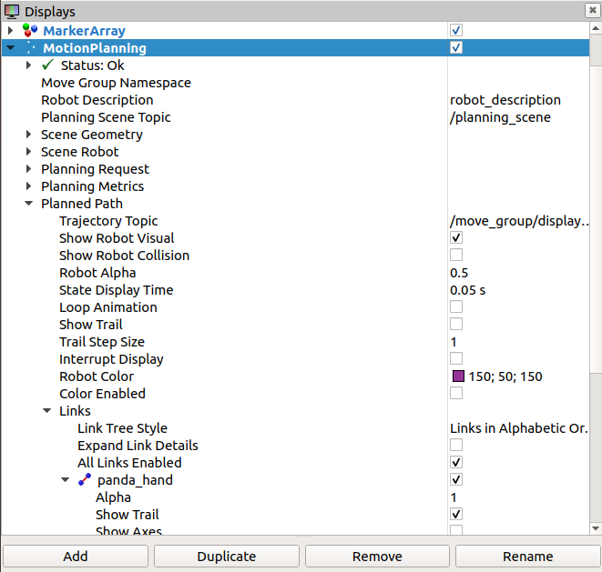

#### Simulation
**********

##### Setting up RViz and Gazebo for Panda Simulation

Save the python file to be simulated in the VM folder ```catkin_ws/src/franka_gazebo/scripts```

Start roscore
Open a new terminal and type ```$ roscore``` 

Start Gazebo
Open a new terminal and type
```$ cd catkin_ws```

```$ source level/setup.bash```

```$ rosin gazebo_ros gazebo```

Add Panda
Open a new terminal and type
```$ cd catkin_ws```

```$ source level/setup.bash```

```$ roslaunch franka_gazebo panda_arm_hand.launch```

You should now see Panda in the Gazebo emulation pointing upwards.

Start MoveIt!
Open a new terminal and type
```$ cd catkin_ws```

```$ source devel/setup.bash```

```$ roslaunch panda_moveit_config demo.launch rviz_tutorial:=true```

RViz will start
Add motion planning
Make sure the Planning Scene Topic is set to /planning_scene
In Planning Request, change the Planning Group to panda_arm
You should see Panda in RViz in the same pose as Gazebo

Start the node connecting MoveIt! to Gazebo
Open a new terminal
```$ cd catkin_ws```

```$ cd src/panda_publisher```

```$ python panda_publisher.py```

Updating the Gazebo simulation gains
Open a new terminal
```$ cd catkin_ws```

```$ cd src/franka_gazebo/config```

```$ edit default.yaml```

Edit the file to match this
[image of the yams file]
Save and close the file


Controlling Panda
Open a new terminal
```$ cd catkin_ws```

```$ cd src/franka_gazebo/scripts```

```$ python ‘YOUR FILE NAME’.py```

###### Motion Planning Simulation

Before real-life implementation of the code on the Panda robot, the entire task was tested using RViz and Gazebo simulations. This allowed for all poses and time functions to be tested without the risk of damaging the actual robot. It also made it easier to collaborate on and iteratively improve the code as it was not necessary for each team member to individually access the physical robot. The Panda model was loaded, spawned and placed into the Gazebo environment, then controlled with the Python code written by the group members.

###### Light Painting Simulation

By tracing the position of the end effector in RViz, it allowed the path of the attached light-painting module to be recreated in the RViz viewport. This method proved to be much more efficient than camera implementation within Gazebo, which required additional plugins (such as a camera sensor plugin to publish the live image to an image topic and LinkPlot3DPlugin to achieve isolated link tracing) and produced a noisier output due to the shaking exhibited within Gazebo simulations. This effectively generated a digital model of the light painting that the Panda robot would recreate in real life.

To initialize the light tracing simulation in RViz, go to:

1. Motion Planning
2. Planned Path
3. Links
4. Check Panda_Hand[_]
5. Check Show Trail [_]


